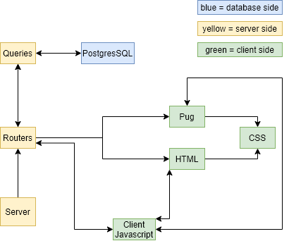
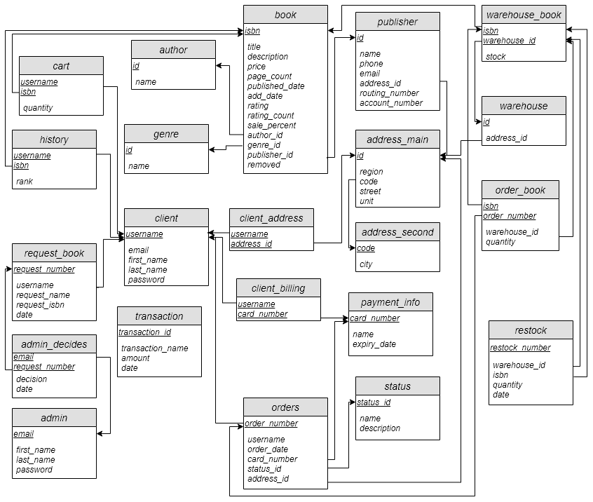
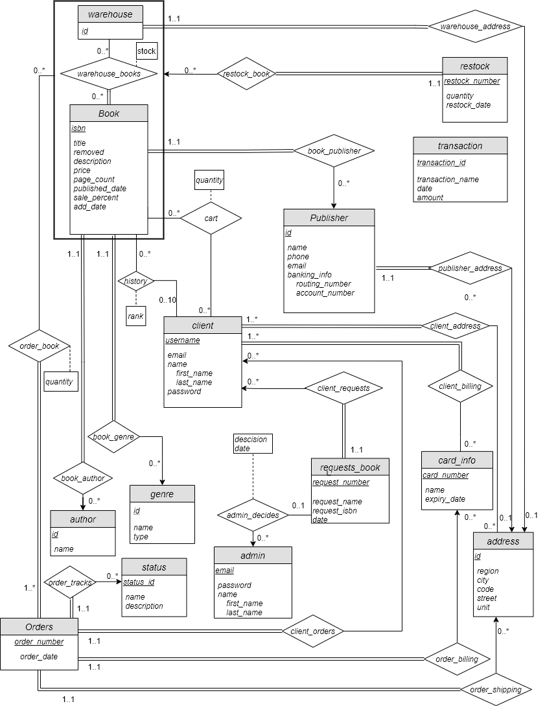

# Book Sanctum, an artificial bookstore web application

## Overview

This bookstore application was created as the main project for a Carleton University course, COMP 3005: Database Management Systems in April 2020. The specification for this project was to design an SQL server to contain relevant bookstore information, then develop a front-end for it. I chose to create a simple online website as shown here. Note, however that this application is artificial, in that the user does not have the capability of actually ordering books online. As such, please be advised that inputting personal information is strictly discouraged. 

## Architecture

The project implements node.js and express for the server side and basic CSS for stylization. One future goal of the project is to develop a more robust front-end system, such as implementing React, etc. and creating a more friendly mobile experience. 

The back-end is handled by PostgreSQL and hosted on Heroku. The files for the SQL schema can be found [here](SQL/).

The below image showcases the architecture developed for this project:

## Diagrams

### Schema

## Entity-Relation (ER)

