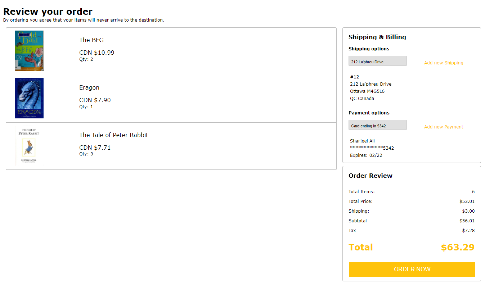
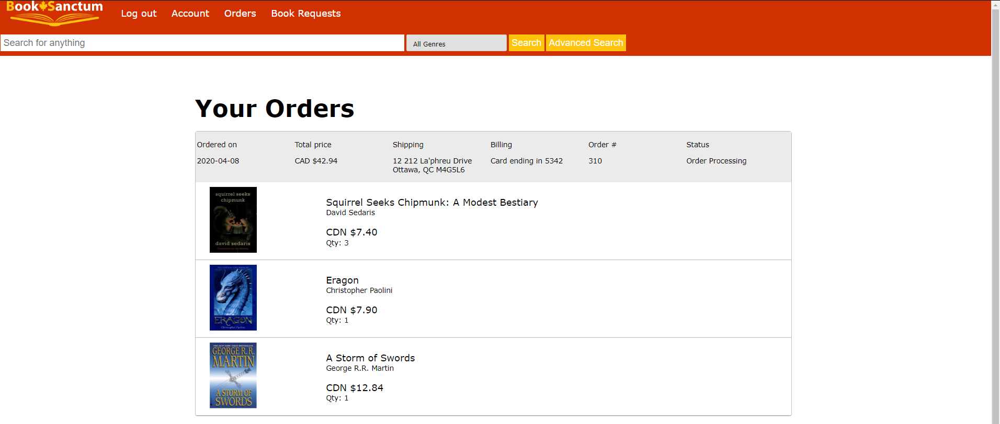

# Book Sanctum, an artificial bookstore web application

## Contents
1. [Overview](#Overview)
2. [Architecture](#Overview)
3. [Guide](#guide)
4. [Screenshots](#screenshots)
5. [Database Diagrams](#Database-Diagrams)

## Overview

This bookstore application was created as the main project for a Carleton University course, COMP 3005: Database Management Systems in April 2020. The specification for this project was to design an SQL server to contain relevant bookstore information, then develop a front-end for it. I chose to create a simple online website as shown here. Note, however that this application is artificial, in that the user does not have the capability of actually ordering books online. As such, please be advised that inputting personal information is strictly discouraged. As a final note, the bookstore allows both clients and managers to view and manage the bookstore using unique pages. 

The official report can be found [here](/documentation/101070889.pdf) which goes in depth about the application. 

## Architecture

The project implements node.js and express for the server side and basic CSS for stylization. The Pg module was used to connect with PostgreSQL. One future goal of the project is to develop a more robust front-end system, such as implementing React, etc. and creating a more friendly mobile experience. As for the front end, Pug was used in some cases where required and chart.js was used for displaying certain chart images. 

The back-end is handled by PostgreSQL and hosted on Heroku. The files for the SQL schema can be found [here](SQL/).

The below image showcases the architecture developed for this project:

## Guide

The workflow is indicated as here:

To setup the application, first clone the repo. After this, go into the [code](/code) directory and run:

## Screenshots

### Home

### Creating account

### Advanced Search

### Search Results

### Book info

### Checkout

### All orders

### Admin home page

### Adding new books

### Viewing transactions

### Viewing Sales

## Database Diagrams

### Schema

## Entity-Relation (ER)

